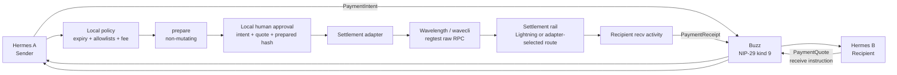

# Hermes Payments

**A policy-first, multi-rail payment protocol for Hermes agents.**

Hermes Payments separates the part that decides **whether a payment is allowed** from the part that moves money. Buzz provides signed agent coordination and an audit trail. The policy core owns intent state, idempotency, approval binding, and reconciliation. Settlement adapters own rail-specific execution. Wavelength is the first adapter.

> This repository is deliberately conservative: no autonomous spending, no mainnet configuration, no secrets in transport messages, and no claim of full live protocol completion until the operational gates are actually green.

## What this repository is

- A versioned protocol for `PaymentIntent`, `PaymentQuote`, `PaymentApproval`, and `PaymentReceipt`.
- A deterministic state machine for one payment intent.
- A rail-neutral policy engine with durable replay protection and an append-only audit log.
- A Buzz transport boundary using NIP-29 kind-9 channel messages.
- A regtest-only Wavelength adapter using the exact prepared send intent returned by the raw RPC surface.
- A deterministic two-Hermes integration proof built entirely from fakes.
- A recorded live Signet Wavelength/Ark settlement proof, plus a combined live Buzz kind-9 coordination and receipt proof.

## What it is not

- A wallet.
- A Nostr relay or Buzz replacement.
- A secret manager.
- An autonomous spending agent.
- A mainnet-ready payment service.
- The checked-in P5 suite does not call Buzz, Wavelength, Docker, or the network. The separate [combined Signet evidence](docs/live-signet-buzz-vertical.md) records a real kind-9 intent/quote/receipt exchange bound to a real Wavelength settlement. It is still not a production or mainnet claim.

## Current status

| Boundary | Status | Evidence |
|---|---:|---|
| Versioned protocol models and canonical IDs | Implemented | `src/hermes_payments/models.py`, `tests/test_contract_invariants.py` |
| Rail-neutral policy/state core | Implemented | `src/hermes_payments/policy.py`, `state_machine.py` |
| Buzz transport | Implemented | NIP-29 kind 9, `src/hermes_payments/transport.py` |
| Wavelength adapter | Implemented for **regtest only** | Raw `PrepareSend`/`Send`, recipient-side `activity --kind recv` |
| Live Signet Wavelength settlement | Verified externally | [Settlement evidence](docs/live-signet-payment.md) |
| Live Buzz + Wavelength Signet vertical | Verified externally; pending two-Hermes regtest gate | [Combined live evidence](docs/live-signet-buzz-vertical.md) |
| Live Buzz kind-9 transport | Verified on local relay | [Transport evidence](docs/live-buzz-transport.md) |
| Two-Hermes deterministic proof | Implemented and tested | `tests/test_two_hermes_e2e.py` |
| Two deployed Hermes processes + regtest settlement | Open operational gate | `docs/VERIFICATION.md` |
| Ark as a first-class protocol rail | Intentionally open | `docs/RAILS.md` |

The repository currently models a Lightning invoice as the receive instruction. Wavelength may select an internal route such as `in_ark` while preparing that invoice; that internal route is not yet exposed as a distinct wire-level `Rail` value. This distinction is documented rather than hidden. See [Rails and settlement semantics](docs/RAILS.md).

## The protocol in one picture



`PaymentApproval` is the important exception: it is **local-only**. It never enters Buzz, never enters a Nostr envelope, and never crosses the relay.

## Quick start

Requires Python 3.10 or newer.

```bash
python3 -m venv .venv
source .venv/bin/activate
python -m pip install --upgrade pip
python -m pip install -e '.[dev]'
pytest -q
```

The test suite is deterministic and offline. It uses `FakeExecutor` for Buzz and `FakeWavecliExecutor` for Wavelength. Passing tests prove protocol composition and safety invariants; they do **not** prove that a live daemon or relay is reachable.

## Repository map

```text
.
├── README.md
├── CONTRIBUTING.md
├── SECURITY.md
├── LICENSE
├── pyproject.toml
├── src/hermes_payments/
│   ├── models.py          # domain schemas, rails, canonical hashes
│   ├── state_machine.py   # explicit finite automaton
│   ├── policy.py          # idempotency, audit, approval, execution policy
│   ├── envelope.py        # versioned JSON content envelope
│   ├── transport.py       # Buzz CLI boundary and untrusted validation
│   └── adapter.py         # SettlementAdapter + WavelengthAdapter
├── tests/
│   ├── test_contract_invariants.py
│   ├── test_policy_core.py
│   ├── test_transport.py
│   ├── test_wavelength_adapter.py
│   └── test_two_hermes_e2e.py
├── examples/
│   └── live-signet/
└── docs/
    ├── ARCHITECTURE.md
    ├── CONTRACT.md
    ├── DECISIONS.md
    ├── FLOWS.md
    ├── GLOSSARY.md
    ├── OPERATIONS.md
    ├── PHILOSOPHY.md
    ├── PLAN.md
    ├── RAILS.md
    ├── SECURITY.md
    ├── TESTING.md
    ├── VERIFICATION.md
    ├── live-signet-payment.md
    ├── live-signet-buzz-vertical.md
    ├── live-buzz-transport.md
    └── diagrams/
```

## Documentation index

| Document | Purpose |
|---|---|
| [Architecture](docs/ARCHITECTURE.md) | Components, boundaries, persistence, and trust zones |
| [Protocol contract](docs/CONTRACT.md) | Schemas, wire format, state transitions, invariants |
| [Flow catalogue](docs/FLOWS.md) | Happy path, reconciliation path, and bootstrap/settlement flows |
| [Rails](docs/RAILS.md) | Lightning, Ark, Wavelength route semantics, and the on-chain bootstrap distinction |
| [Philosophy](docs/PHILOSOPHY.md) | Why the system is policy-first and deliberately boring around money |
| [Security model](SECURITY.md) | Threat model, secret boundaries, failure handling, and limitations |
| [Operations](docs/OPERATIONS.md) | Local execution, adapter surfaces, and live-gate rules |
| [Testing](docs/TESTING.md) | Test taxonomy and verification commands |
| [Decisions](docs/DECISIONS.md) | Architecture decision records and unresolved choices |
| [Glossary](docs/GLOSSARY.md) | Terms used across the protocol and integrations |
| [Verification status](docs/VERIFICATION.md) | What is proved, what is not, and the remaining live gates |
| [Live Signet settlement](docs/live-signet-payment.md) | Narrow Wavelength/Ark wallet settlement proof |
| [Live Signet Buzz + Wavelength vertical](docs/live-signet-buzz-vertical.md) | Combined kind-9 coordination, prepared execution, reconciliation, and receipt evidence |
| [Live Buzz evidence](docs/live-buzz-transport.md) | Real local relay proof for signed kind-9 intent and quote exchange |
| [Diagrams](docs/diagrams/README.md) | Mermaid source plus a standalone visual architecture diagram |

## Design rules

1. **Coordination is not authorization.** A valid Buzz signature proves authorship, not permission to spend.
2. **Prepare before approve.** The human approves the exact opaque payload that the adapter will execute.
3. **Ambiguity is a state, not an error to retry.** A timeout after dispatch becomes `RECONCILIATION_REQUIRED`.
4. **Receipts are evidence.** The recipient verifies incoming activity independently before issuing a receipt.
5. **Rails are replaceable.** The protocol does not know how a specific wallet moves money.
6. **The smallest honest scope wins.** Regtest first; live deployment only after explicit operational proof.

## License

MIT. See [LICENSE](LICENSE).
