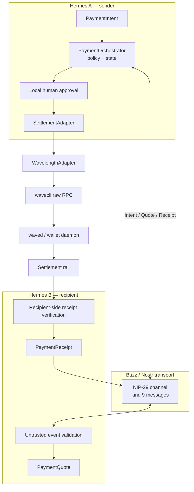

# Architecture

Hermes Payments is a set of narrow boundaries rather than one large “payment agent.” Each boundary has a different trust level and a different job.

## System view



## Layers

### Domain layer — `models.py`

Defines typed `PaymentIntent`, `PaymentQuote`, `PaymentApproval`, `PaymentReceipt`, `Rail`, `RailReceiveInstruction`, canonical serialization, and SHA-256 identifiers. Models do not call Buzz, Wavelength, subprocesses, or the network.

### State layer — `state_machine.py`

The explicit finite automaton is the source of truth for lifecycle transitions. The key rule is:

```text
EXECUTING + timeout/unknown/error → RECONCILIATION_REQUIRED
```

It never becomes a normal retryable failure after execution may have started.

### Policy layer — `policy.py`

`PaymentOrchestrator` composes the state machine with intent idempotency, approval-triple replay protection, receipt uniqueness, durable JSON storage, append-only JSONL audit records, expiry checks, allowlists, fee limits, and adapter invocation only after approval.

### Transport layer — `envelope.py` and `transport.py`

Three domain message types travel through a single NIP-29 kind-9 channel message. The content field is a versioned JSON envelope:

```json
{
  "protocol": "hermes-payments",
  "version": "1",
  "type": "payment_intent",
  "payload": {}
}
```

The `h` channel tag is managed by Buzz. Received events are treated as untrusted and checked for kind, channel, protocol/version, schema, expiry, and author identity.

### Settlement layer — `adapter.py`

`SettlementAdapter` exposes:

1. `prepare()` — non-mutating preview and opaque binding payload;
2. `execute()` — exact prepared payload, after local approval;
3. `verify_receipt()` — independent recipient-side settlement check.

`WavelengthAdapter` is the current concrete implementation. It is hard-gated to `regtest` and uses raw RPC because high-level `wavecli send` prepares a fresh intent internally.

## Trust boundaries

| Boundary | Untrusted input | Enforcement |
|---|---|---|
| Buzz → transport | Event JSON, tags, author, kind | `validate_received_event()` |
| Transport → policy | Expired or mismatched messages | Model, expiry, identity checks |
| Policy → adapter | Adapter results | State machine, fee, rail checks |
| Adapter → wallet CLI | CLI JSON and exit status | Strict parsing, redaction, ambiguity mapping |
| Activity → receipt | Wallet activity entries | Reference, amount, and `COMPLETE` match |

## Persistence

The policy core supports two optional local stores:

- **Idempotency store:** JSON, atomically replaced, containing intent IDs, approval triples, and receipt bindings.
- **Audit log:** append-only JSONL with sequence number, timestamp, event name, and selected identifiers.

These are local policy artifacts. They are not Buzz messages and do not contain the opaque prepared payload.

## Current rail caveat

The protocol `Rail` enum currently contains `LIGHTNING` only. Wavelength's raw prepare response exposes an internal route label. In the external Signet experiment, an invoice quote returned `in_ark` with zero expected fee. The current adapter preserves the raw route inside its opaque payload but reports the protocol rail as `LIGHTNING`.

That is a documented limitation, not an invisible conversion. First-class Ark semantics require a contract extension and new tests; see [RAILS.md](RAILS.md) and [DECISIONS.md](DECISIONS.md).

## Deterministic versus live architecture

The checked-in P5 proof uses `FakeExecutor` instead of Buzz, `FakeWavecliExecutor` instead of Wavelength, and manually injected relay events with deterministic authorship. This proves composition. A live proof additionally needs two daemons, real Buzz delivery, funded wallets, real receipt activity, and recovery evidence. See [VERIFICATION.md](VERIFICATION.md).
