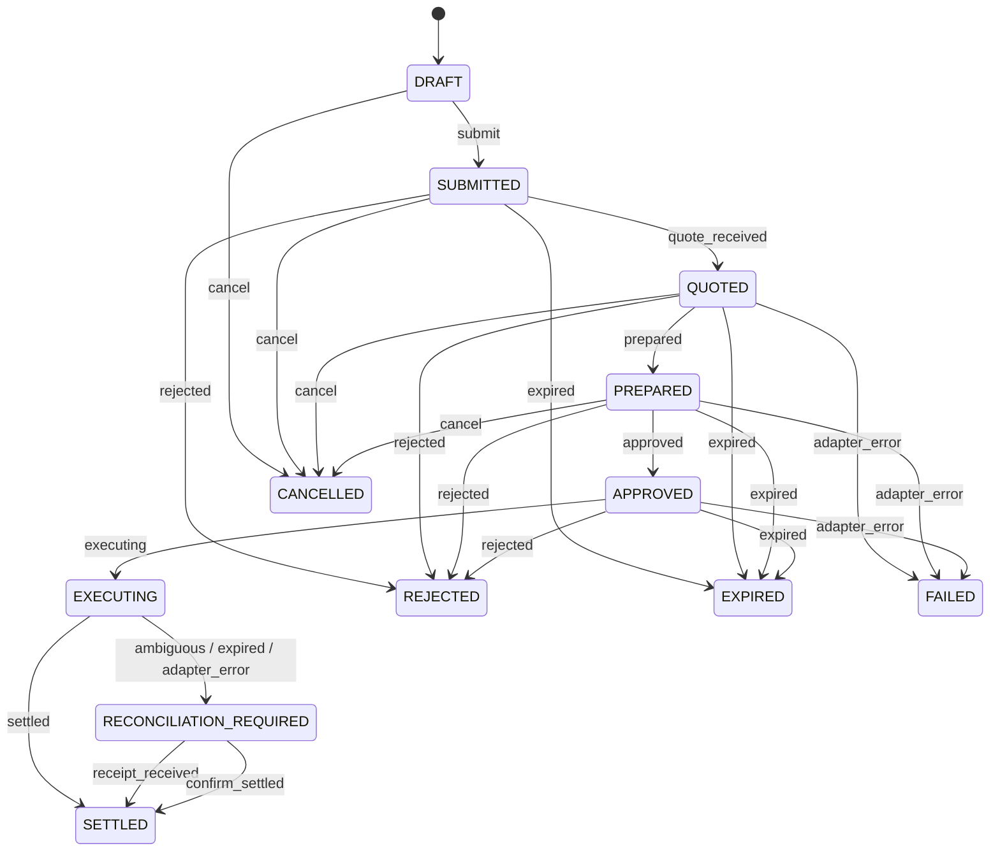

# Hermes Payments Protocol Contract

**Protocol version:** `1`<br>
**Peer boundary:** transport-neutral `PeerTransport`<br>
**Current transport adapter:** Buzz NIP-29 kind-9 channel messages<br>
**Current settlement instruction:** Lightning invoice<br>
**Network scope of the checked-in Wavelength adapter:** regtest only

This is the normative contract for `src/hermes_payments/`.

## 1. Domain messages

### PaymentIntent

The sender requests a payment.

| Field | Type | Rule |
|---|---|---|
| `protocol_version` | literal `"1"` | required |
| `id` | 64-char hex string | SHA-256 of canonical fields excluding `id` |
| `idempotency_key` | string | 1–128 characters |
| `sender` | `AgentIdentity` | required |
| `recipient` | `AgentIdentity` | required |
| `amount_sat` | integer | greater than zero |
| `purpose` | string | 1–512 characters |
| `max_fee_sat` | integer | zero or greater |
| `expires_at` | Unix seconds | policy expiry |
| `created_at` | Unix seconds | creation time |

### PaymentQuote

The recipient accepts the intent and supplies a receive instruction.

| Field | Type | Rule |
|---|---|---|
| `protocol_version` | literal `"1"` | required |
| `id` | 64-char hex string | canonical ID |
| `intent_id` | string | must reference the intent |
| `quote_id` | string | 1–128 characters |
| `recipient` | `AgentIdentity` | event author must match |
| `receive_instruction` | `RailReceiveInstruction` | required |
| `fee_sat` | integer | within intent limit |
| `fee_constraint` | `exact` or `max` | required |
| `expires_at` | Unix seconds | quote expiry |
| `created_at` | Unix seconds | creation time |

Current receive instruction:

```json
{
  "rail": "lightning",
  "invoice": "<BOLT11 invoice>"
}
```

An invoice is a receive instruction. It does not assert that the backend will use public Lightning hops; Wavelength may select an internal route. See [RAILS.md](RAILS.md).

### PaymentApproval

Local human authorization. It is never serialized or transmitted.

| Field | Type | Rule |
|---|---|---|
| `protocol_version` | literal `"1"` | required |
| `id` | string | canonical ID |
| `intent_id` | string | exact intent |
| `quote_id` | string | exact quote |
| `prepared_hash` | string | SHA-256 of opaque prepared payload |
| `approver` | `AgentIdentity` | local approver |
| `created_at` | Unix seconds | approval time |

### PaymentReceipt

Recipient-authored settlement evidence.

| Field | Type | Rule |
|---|---|---|
| `protocol_version` | literal `"1"` | required |
| `id` | 64-char hex string | canonical ID |
| `intent_id` | string | exact intent |
| `quote_id` | string | exact quote |
| `recipient` | `AgentIdentity` | event author must match |
| `settlement_ref` | string | independently verifiable reference |
| `amount_sat` | integer | must equal intent amount |
| `fee_sat` | integer | zero or greater |
| `rail` | `Rail` | current value `lightning` |
| `settled_at` | Unix seconds | settlement time |
| `created_at` | Unix seconds | creation time |

## 2. Canonical IDs

For a Pydantic model:

1. dump with `exclude_none=True`;
2. remove `id`;
3. sort keys recursively;
4. serialize compactly as UTF-8 JSON with `ensure_ascii=False`;
5. compute lowercase SHA-256 hex.

```python
json.dumps(raw, sort_keys=True, separators=(",", ":"), ensure_ascii=False).encode("utf-8")
```

`prepared_hash` is SHA-256 of the opaque adapter payload. The payload is local to the sender and is never put in Buzz.

## 3. Transport-neutral peer contract

The application layer exchanges messages through `PeerTransport`, not through a Buzz-specific API:

```python
class PeerTransport(Protocol):
    def send(self, message: PaymentMessage) -> str: ...
    def receive(self, *, limit: int | None = None) -> list[PeerMessage]: ...
```

`PeerMessage` contains:

| Field | Meaning |
|---|---|
| `message_id` | Stable identifier assigned by the concrete transport |
| `message` | Validated `PaymentIntent`, `PaymentQuote`, or `PaymentReceipt` |
| `author` | Domain author verified by the concrete transport |
| `published_at` | Transport publication timestamp |

`HermesPeer` composes this contract with local policy. It exposes explicit intent, quote, and receipt handoffs and never imports Buzz, Nostr, subprocesses, or settlement adapters. A transport duplicate may have a different `message_id` while carrying the same domain ID; policy idempotency handles that replay.

`PaymentApproval` is not a `PaymentMessage`. Sending it through any `PeerTransport` is rejected.

## 4. Buzz adapter envelope

All transportable messages use one NIP-29 kind-9 event. Content is:

```json
{
  "protocol": "hermes-payments",
  "version": "1",
  "type": "payment_intent | payment_quote | payment_receipt",
  "payload": {}
}
```

Buzz adds the channel `h` tag when using:

```text
buzz messages send --channel <UUID> --content <content>
```

The receive path requires event kind `9`, the expected channel UUID, valid protocol/version/schema, an unexpired message, and an event author matching the domain identity. `PaymentApproval` has no envelope type.

## 5. Lifecycle



Terminal states are `SETTLED`, `FAILED`, `REJECTED`, `EXPIRED`, and `CANCELLED`. `RECONCILIATION_REQUIRED` is non-terminal because a verified receipt or manual confirmation may resolve it.

## 6. Adapter contract

```python
class SettlementAdapter(ABC):
    @property
    def rail(self) -> Rail: ...

    def prepare(instruction, amount_sat, max_fee_sat) -> PrepareResult: ...
    def execute(prepared_payload, prepared_hash) -> ExecuteResult: ...
    def verify_receipt(settlement_ref, expected_amount_sat) -> ReceiptVerifyResult: ...
```

Rules:

- `prepare()` is non-mutating;
- `execute()` is called only after local approval;
- `execute()` consumes the exact prepared binding;
- adapter errors during execution are reconciliation cases;
- no adapter performs an automatic retry;
- credentials remain outside the protocol.

## 7. Invariants

- Same intent fields and idempotency key produce the same ID.
- Replaying an intent is a no-op.
- Approval requires `PREPARED`.
- Approval binds one exact intent, quote, and prepared hash.
- A settled intent cannot transition again.
- A duplicate receipt is rejected.
- A receipt amount must match the intent amount.
- A Buzz event from the wrong channel, kind, author, or protocol is rejected.
- `PaymentApproval` cannot be encoded.
- Unknown or pending execution cannot auto-retry.
