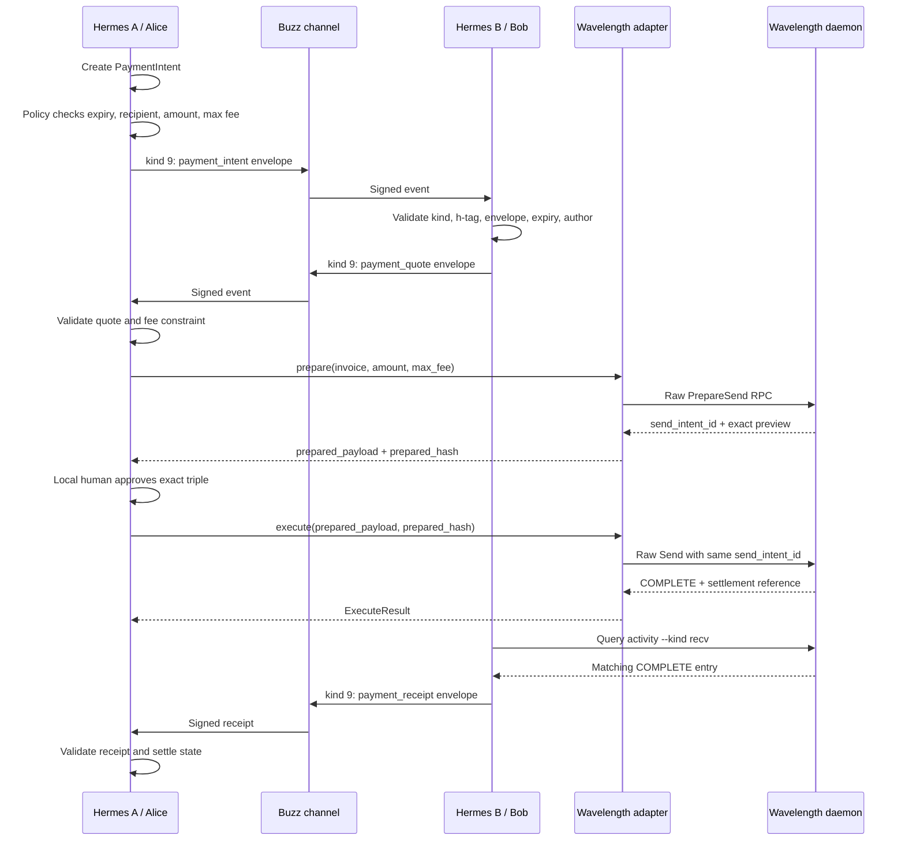
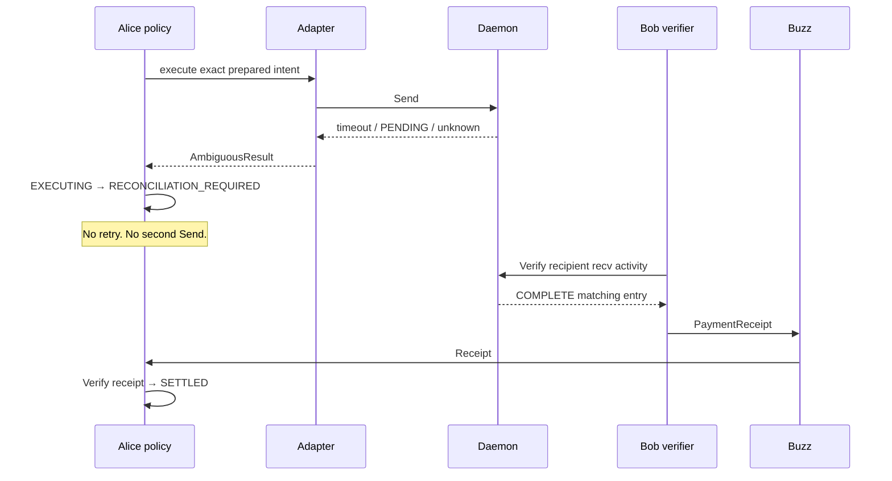
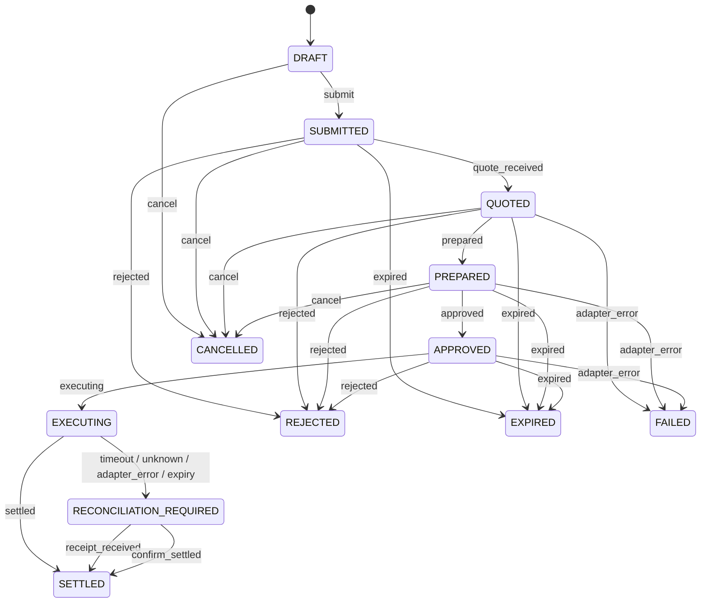
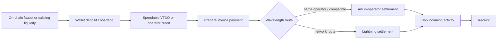
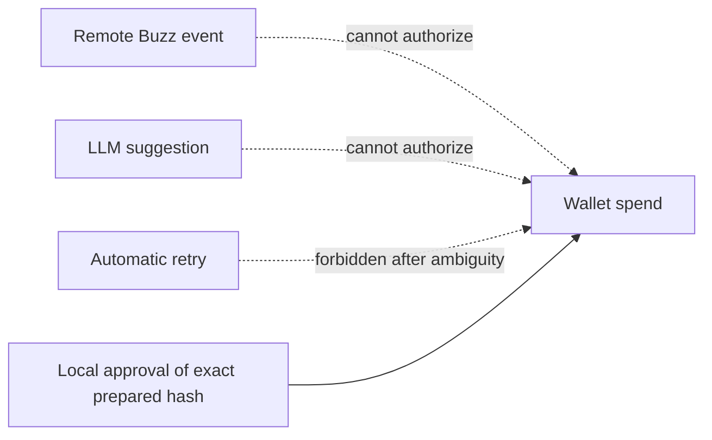

# Flow Catalogue

The diagrams in this document describe protocol behavior. Mermaid source files are versioned under [`docs/diagrams/`](diagrams/).

## 1. Happy path

## 2. Receipt-mediated path

The adapter may return `PENDING`, an unknown status, or an error after dispatch. The sender must stop:

If Bob cannot independently verify the payment, the intent remains in reconciliation.

## 3. Lifecycle state machine

`SETTLED`, `FAILED`, `REJECTED`, `EXPIRED`, and `CANCELLED` are terminal. `RECONCILIATION_REQUIRED` is intentionally non-terminal.

## 4. Bootstrap versus settlement

The on-chain step is not the agent-to-agent payment. It is the initial liquidity/boarding step for a wallet that otherwise has nothing spendable. If an existing VTXO or operator credit is available, it can be skipped.

## 5. What is never in the flow

